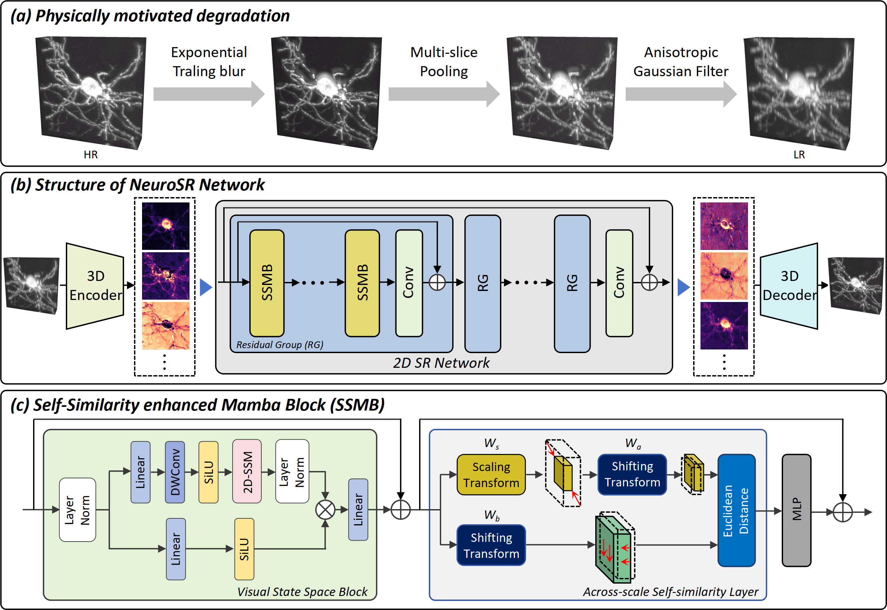

# NeuroSR: 3D Isotropic Reconstruction for Neuronal Images

NeuroSR is a deep learning framework that restores high-resolution, isotropic 3D volumes from anisotropic neuronal microscopy images. It solves the critical issue of blurry axial resolution in techniques like STP and fMOST, enabling clear, detailed visualization and robust analysis of complex neuronal morphology.



## Features

- Physics-Informed Degradation Model: we generate realistic training pairs by simulating the anisotropic axial degradation inherent in tomographic microscopy, enabling the network to learn authentic restoration priors.
- High-Efficiency 3D SR: we propose a 2.5D strategy that first distills the volume into a 2D latent space for feature enhancement, prior to reconstructing the isotropic 3D result, significantly lowering the computational burden.
- Neuronal Morphology-Aware Network Design: we introduce Self-Similarity enhanced Mamba Block (SSMB) that integrates a state-space model with cross-scale self-similarity learning, explicitly capturing the long-range continuity and structural repetitiveness characteristic of neuronal morphologies.
- State-of-the-Art Reconstruction Performance: NeuroSR consistently outperforms existing methods in quantitative metrics and visual quality, delivering isotropic volumes with high structural fidelity and minimal artifacts.

## Requirements

- **Python**: 3.11
- **PyTorch**: 2.4.0 (CUDA 12.4)
- **CUDA**: 12.4
- **Mamba**:2.2.2

## Installation

```bash
git clone https://github.com/Gao-Songmin/NeuroSR.git
```

## Quick Start

```bash
python test_on_real.py
```

## Training

```bash
python train.py
```
